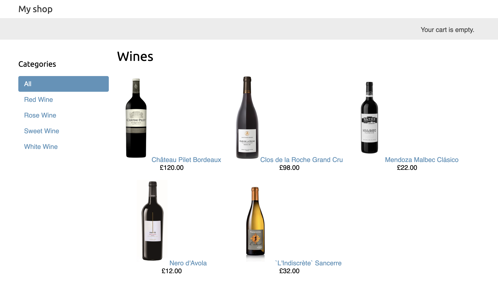
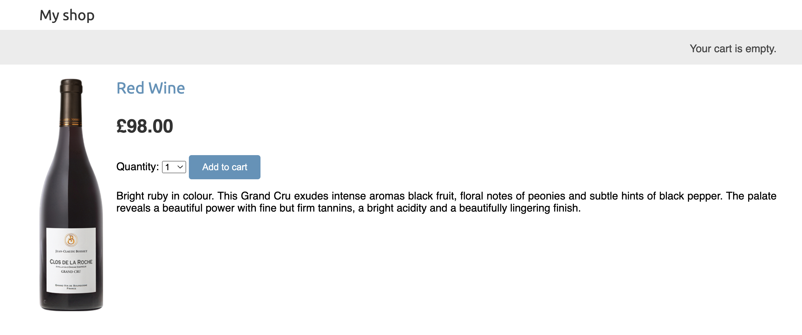
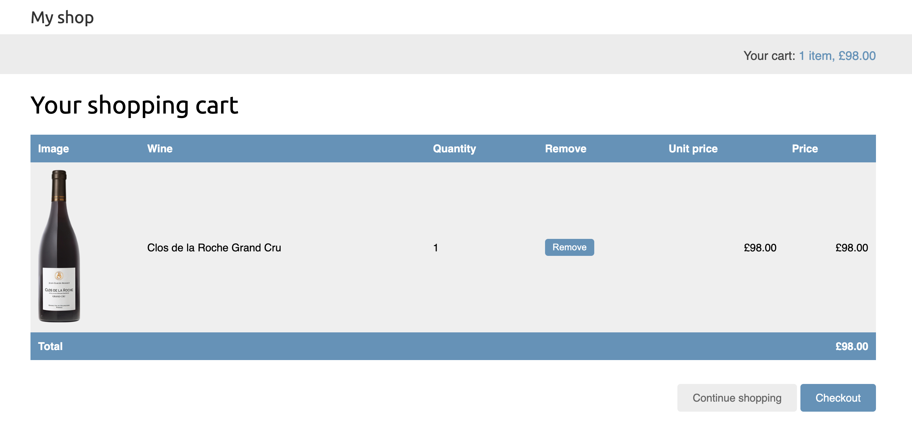
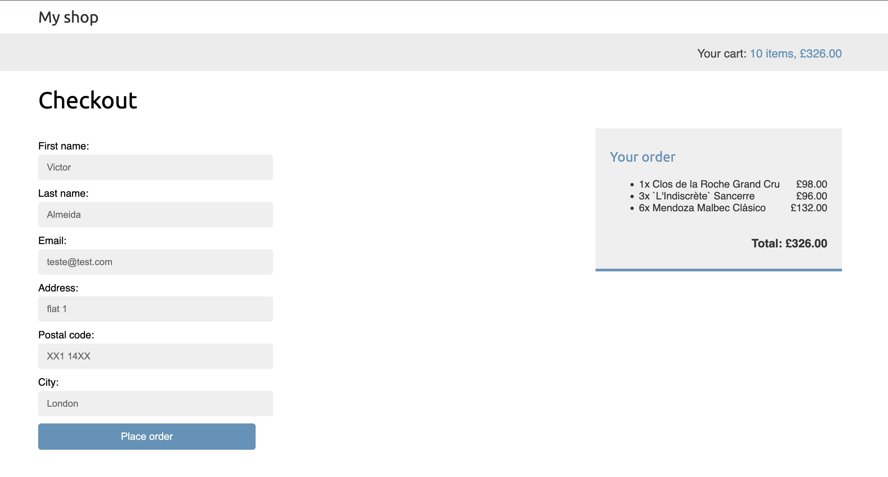
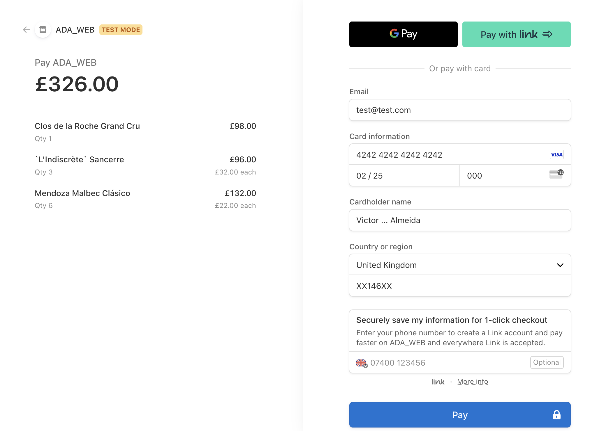
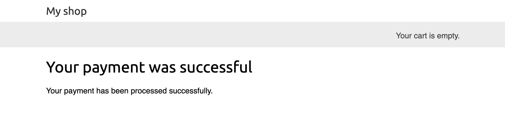

# Wine E-commerce
The Wine E-commerce is a Django project that allows users to browse and purchase wines. The project is divided into two main applications: the store and the cart. The store application allows users to browse wines, view details, and add them to the cart. The cart application allows users to view and update their cart, and proceed to checkout. The project also includes a payment process with Stripe, and asynchronous tasks with Celery and RabbitMQ.

# Features
- Browse wines
- View wine details
- Add wines to the cart
- View and update the cart
- Proceed to checkout
- Enter shipping information
- Enter payment details
- Payment process with Stripe
- Receive email confirmation
- Asynchronous tasks with Celery and RabbitMQ


# Installation
To install the project, clone the repository and create a virtual environment. Then, install the dependencies with the following command:
```
pip install -r requirements.txt
```
After installing the dependencies, create a `.env` file in the root directory of the project with the following
environment variables:
```
DEBUG=True
SECRET_KEY=your_secret_key
ALLOWED_HOSTS=your_allowed_hosts

STRIPE_PUBLIC_KEY=your_stripe_public_key
STRIPE_PUBLISHABLE_KEY = your_stripe_publishable_key
STRIPE_SECRET_KEY=your_stripe_secret_key
STRIPE_WEBHOOK_SECRET=your_stripe_webhook_secret

EMAIL_HOST=your_email_host
EMAIL_PORT=your_email_port
EMAIL_HOST_USER=your_email_host_user
EMAIL_HOST_PASSWORD=your_email_host_password
EMAIL_USE_TLS=True

DB_NAME=your_database_name
DB_USER=your_database_user
DB_PASSWORD=your_database_password
DB_PORT=your_database_port

CELERY_BROKER_URL=your_celery_broker_url
CELERY_RESULT_BACKEND=your_celery_result_backend
```


# Running Migrations
Before running the project, apply the migrations with the following command:
```
python manage.py migrate
```

# Creating a Superuser
To create a superuser, execute the following command:
```
python manage.py createsuperuser
```


# Running the Project
To run the project, execute the following command:
```
python manage.py runserver
```
The project will be available at `http://127.0.0.1:8000/`.


# Store Application
The store application allows users to browse wines, view details, and add them to the cart. The wines are displayed on the home page and can be filtered by category. Users can click on a wine to view details and add it to the cart

## Home Page


## Wine Details



# Cart Application
The cart application allows users to view and update their cart, and proceed to checkout. Users can view the wines in their cart, update the quantity, and remove wines. Users can proceed to checkout by entering their shipping information and payment details.

## Cart


## Checkout



# Payment Process with Stripe
The project includes a payment process with Stripe. Users can proceed to checkout and enter their payment details. The payment is processed with Stripe and users receive a confirmation message.

## Payment


## Confirmation



# Asynchronous Tasks with Celery and RabbitMQ
The project includes asynchronous tasks with Celery and RabbitMQ. When a user places an order, an asynchronous task is created to send an email confirmation. The task is processed by a Celery worker and the user receives an email confirmation.


# Conclusion
The Wine E-commerce is a Django project that allows users to browse and purchase wines. The project includes a store application that allows users to browse wines, view details, and add them to the cart. The cart application allows users to view and update their cart, and proceed to checkout. The project also includes a payment process with Stripe, and asynchronous tasks with Celery and RabbitMQ.

